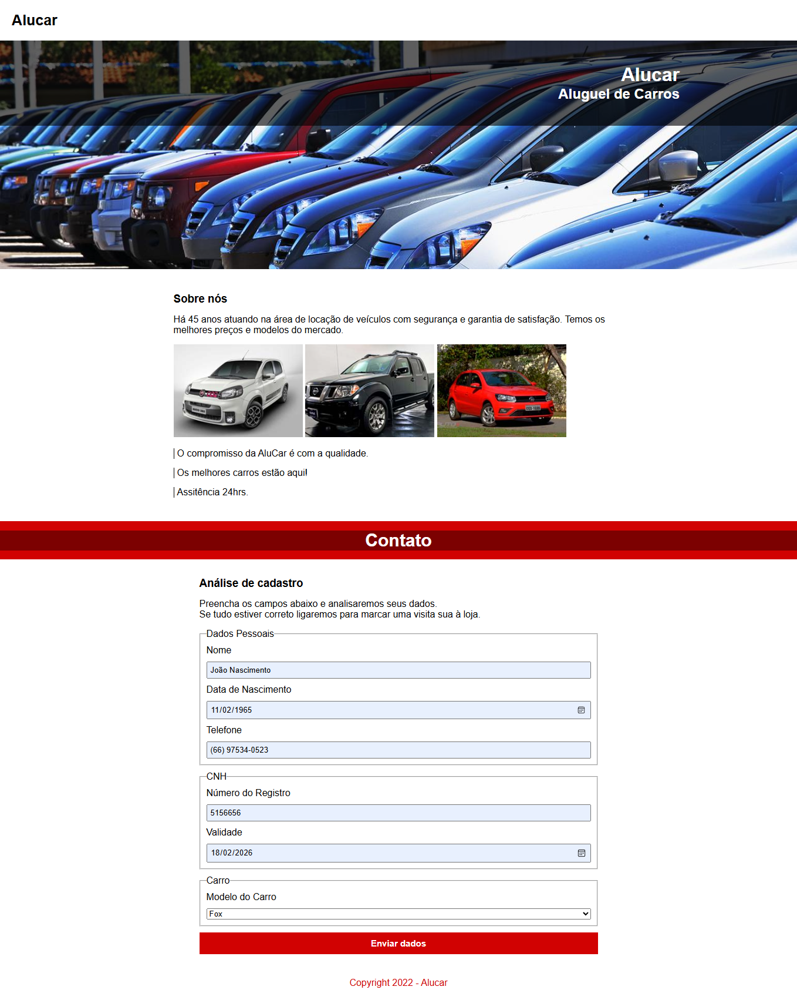

# 🚗 Alucar – Sistema de Cadastro para Locação de Veículos

Projeto desenvolvido como parte dos estudos em **HTML5 e CSS3**, com foco principal na **criação e estruturação de formulários HTML**, utilizando diferentes tipos de inputs, validações nativas e organização semântica com `fieldset` e `legend`.

---

## 🧩 Sobre o projeto

O **Alucar** é um site fictício de uma locadora de veículos, composto por:

- 🏠 Seção inicial com banner institucional  
- 📖 Seção “Sobre nós” com galeria de imagens  
- 📋 Seção de contato com **formulário completo para análise de cadastro**

O objetivo do projeto é praticar:

- Estruturação semântica com HTML5  
- Organização visual com CSS3  
- Criação de formulários completos  
- Aplicação de validações nativas com `required`  

---

## 📝 Estrutura do Formulário

O formulário foi dividido em três grupos principais utilizando `fieldset` para melhor organização:

### 👤 Dados Pessoais
- 🔤 Input `text` para nome  
- 📅 Input `date` para data de nascimento  
- 📞 Input `tel` para telefone  

### 🪪 CNH
- 🔢 Input `number` para número do registro  
- 📅 Input `date` para validade da CNH  

### 🚘 Carro
- 🔽 `select` com agrupamento utilizando `optgroup`
  - Volkswagen (Gol, Golf, Fox)  
  - Fiat (Uno, Siena, Palio)  
  - Nissan (Frontier, Versa, Skyline GT-R)  

Todos os campos utilizam o atributo **`required`**, garantindo validação básica antes do envio.

---

## 🎯 Conceitos aplicados

- ✔️ Estrutura semântica com `header`, `main`, `section` e `footer`  
- ✔️ Organização de formulário com `form`, `fieldset` e `legend`  
- ✔️ Utilização de múltiplos tipos de `input`  
- ✔️ Uso de `select`, `option` e `optgroup`  
- ✔️ Estilização com Flexbox  
- ✔️ Estilização de botões e campos  
- ✔️ Background com imagem e sobreposição de cor  

---

## 🎨 Estilização (CSS)

O projeto utiliza:

- 🎯 Reset básico com `*`  
- 📦 `box-sizing: border-box`  
- 📐 Flexbox para organização de layout  
- 🖼️ `background-image` para o banner principal  
- 🎨 Paleta em vermelho para reforçar identidade visual  
- 📏 Larguras centralizadas com `margin: 0 auto`  

---

## 🖥️ Tecnologias utilizadas

- HTML5  
- CSS3  

---

## 📸 Demonstração do projeto

### 🏠 Página Inicial

### 📋 Seção de Cadastro
(Formulário com validação e seleção de veículos)

---

## 📚 Objetivo de aprendizado

Este projeto foi criado com foco em **aprimorar conhecimentos em formulários HTML**, entendendo:

- Como organizar informações em grupos  
- Como aplicar validações nativas  
- Como melhorar a experiência do usuário com estrutura clara  
- Como integrar formulário com um endpoint externo via atributo `action`  

---

✨ Projeto desenvolvido para fins de estudo.
